# INTRODUCE YOURSELF - android mobile app

Introduce yourself is a mobile application in the form of a social network focused on sharing your thoughts as posts and links to your social media (or other). The user can register and invite friends using the social tab. Users connected by friendship can exchange messages with each other. Finding users can be done not only using the search card but also by the QR scanner card where we can share or scan the shared QR code. Created posts can be rated by others - top users by positive posts ratings from the period of a given day are positioned on the main page of the application.

**App uses polish language pack - to change language it's neccessary to translate the file \app\src\main\res\values\strings.xml**

## Sign Up & Sign In cards
The entered values are length validated and there is regex used to check if inputs match patterns (ex. surname validation accepts: two-part names separated with a dash, first letter in uppercase and the rest in lowercase, string from 2 to 30 characters). A profile picture is required when registering.

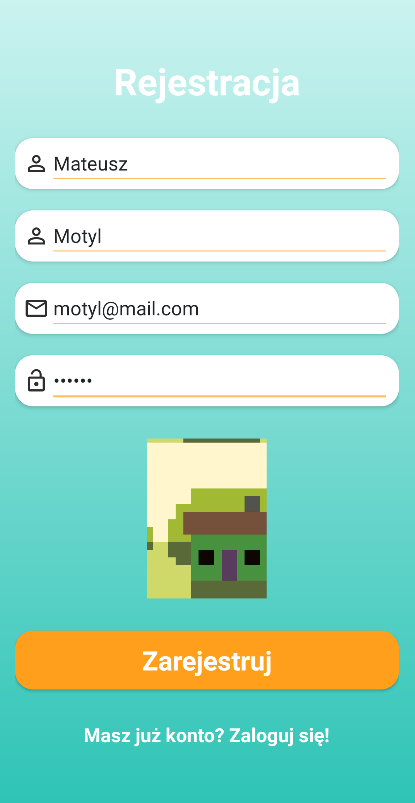
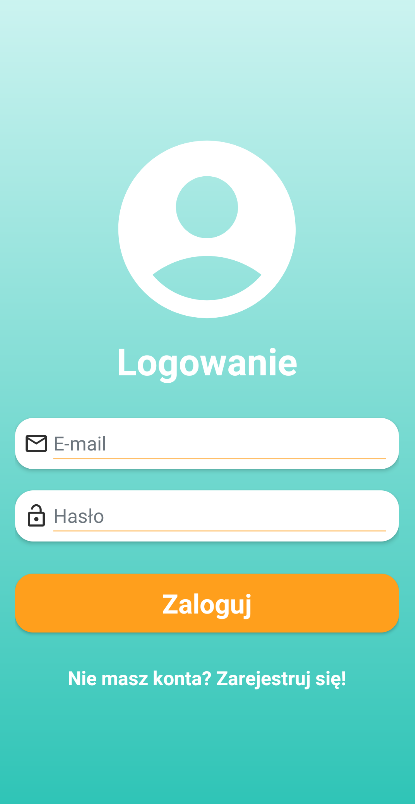

## Main page with sliding side menu bar

Main page shows some top users by sum of positive posts ratings from the period of a given day. You can go to their account by clicking on an item from the main list. There is a sliding side menu bar in the top left corner from where you can move between the pages of the application.

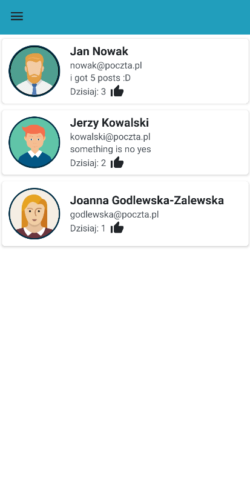
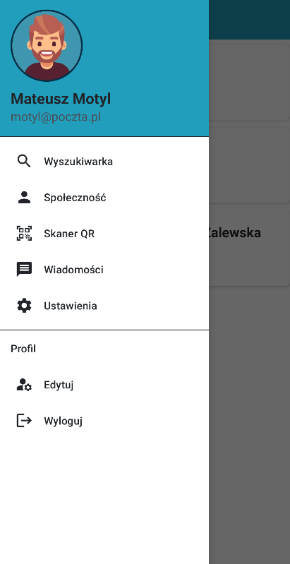

## User profile
The user's profile displays his profile picture, background picture (if added, not neccessary), personal data, shared posts and links. There is also a daily like counter which reacts to changes in posts likes. As it is in many other activities of this app there is a toolbar at the top which allows to move back to the previous page. There are also two other buttons on it - remove friend (by default: add friend, but accounts are already friends on the photo below) and messages (by default: invisible, but already friends on the photo below). Posts can be rated by clicking thumb up or thumb down (or undo the rating by clicking the same button one more time). Maximum number of added links is 20, but the number of posts is unlimited - there is a posts pagination that only shows 5 posts and two buttons: read 5 more, read 5 previous - if any.

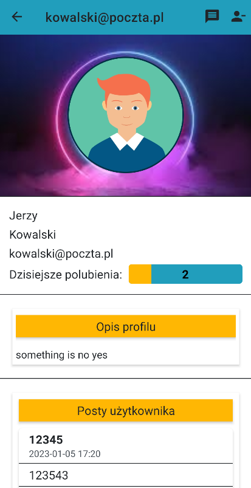
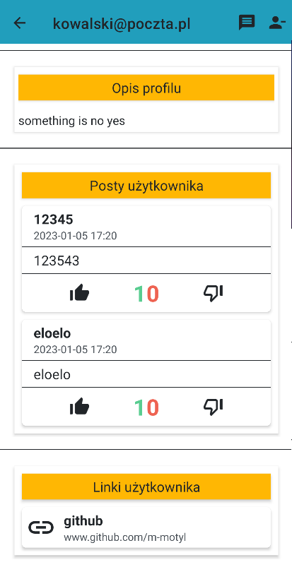

## Community card - friends, invitations
It is a card divided into two sub-cards: friends (displayed by default) - displays list of friends; invitations - display list of friend invitations, where user can decide wheter to add or remove an invitation.

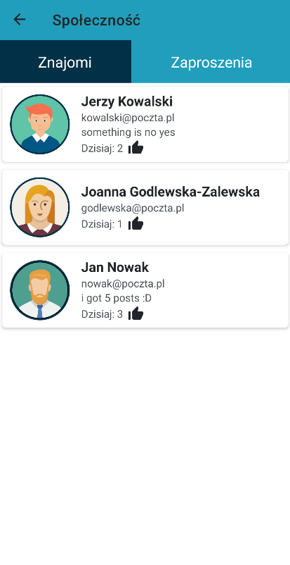
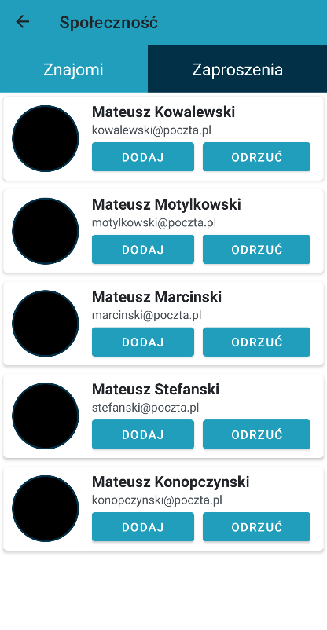

## Messages
Message activity is available from the side menu bar on the home page or by clicking the message icon in the toolbar in the user's profile. The messages of the already logged user are on the right side of the page. Every message buble has a timestamp on it and there is also date displayed under several conditions: new conversation, 15 minutues difference between messages, date difference between messages (ex. msg1 time = 23:59 21.02.2023, msg2 time = 00:01 22.02.2023 <- there is a date difference even if it's two minutes difference).

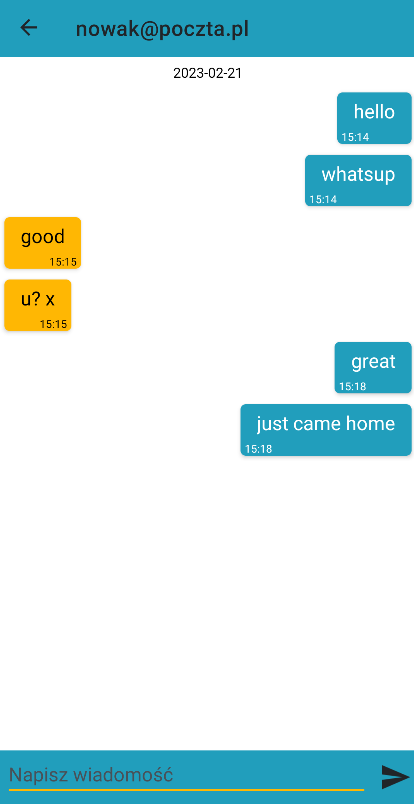

## QR CODE card - code sharing, code scanning
The QR code stores the user's email which is unique to other users - duplication is not possible. Card is divided into two sub-cards: the one which displays user QR code and the one to scan the code (app was tested using an android emulator, so it was necessary to use a webcam). To change the sub-card user needs to move the switch to the right direction. 

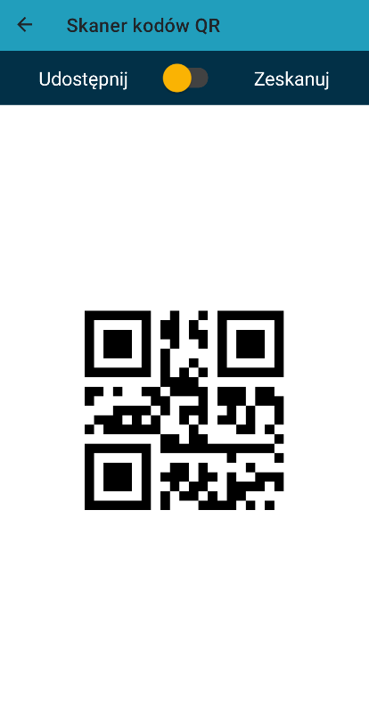
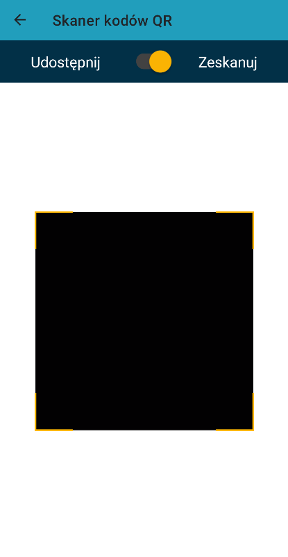

## Search card & Settings card
Search card and settings card are accessory cards. First one is for searching users and uses pagination when there is more than 5 search results. The other card is for changing password and changing app theme - default theme is blue/ yellow. There is also a dark style (night mode) and a green/ pink style. Once changed theme will be displayed until the next change.

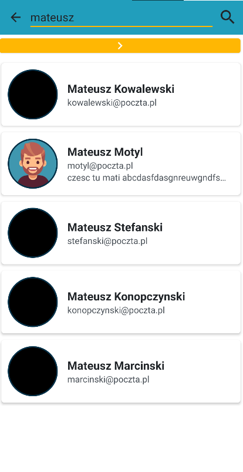
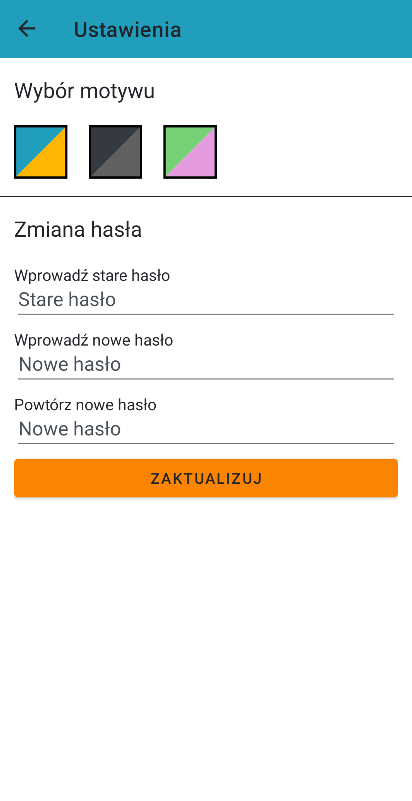

## Contributors & Contrubutions
**Mateusz Motyl - backend (app functionality)**

Witold Gliwa - backend (database)

Patryk Zarzycki - frontend
